# 基于springboot+vue的智能物流管理系统

---
### 👉作者QQ ：1556708905 微信：zheng0123Long (支持定制修改、部署调试、定制毕设)

### 👉接网站建设、小程序、H5、APP、各种系统等

---

#### 介绍

在电子商务迅猛发展的当下，物流行业的高效运作至关重要。本基于 Spring Boot + Vue 的智能物流管理系统应运而生，旨在为物流企业提供全面、智能、高效的管理手段，以应对日益复杂的物流业务需求。

#### 技术栈

后端技术栈：Springboot+Mysql+Maven

前端技术栈：Vue+Html+Css+Javascript+ElementUI

开发工具：Idea+Vscode+Navicate

#### 系统功能介绍

（一）管理员角色  
个人中心：查看和修改个人基本信息，接收系统通知和重要消息 。  
顾客管理：查看顾客详细信息，对顾客进行分类和标记，处理顾客投诉和建议 。  
员工管理：新增员工信息，编辑员工工作信息和权限，查看员工绩效和工作记录，辞退或暂停员工账号 。  
店主管理：登记店主基本信息和所属门店，审核店主资质和权限，监督店主经营活动 。  
门店信息管理：新增和编辑门店详细信息，查看门店运营状态和业绩，分配门店资源和任务 。  
门店员工管理：为门店分配和调整员工，查看门店员工工作安排和出勤情况 。  
部门分类管理：划分和管理物流企业的各个部门，明确各部门职责和工作流程 。  
订单信息管理：查看所有订单详细信息，跟踪订单处理进度，对异常订单进行处理和协调 。  
工作日志管理：查看员工、店主和整个企业的工作日志，对工作日志进行审核和评价，通过工作日志分析工作效率和问题 。  

（二）店主角色  
个人中心：维护个人资料和联系方式，查看店铺相关通知和消息 。  
员工管理：招聘和解雇门店员工，安排员工工作任务和班次，评估员工工作表现 。  
门店信息管理：查看和更新所属门店基本信息，制定门店运营计划和目标 。  
门店员工管理：培训和指导门店员工，处理员工请假和调休申请 。  
工作日志管理：撰写和提交个人工作日志，查看门店员工工作日志 。  

（三）员工角色  
个人中心：完善个人信息和工作履历，接收工作安排和通知 。  
门店信息管理：了解所在门店详细情况和规章制度，反馈门店设施问题和改进建议 。  
订单信息管理：处理分配给自己的订单任务，更新订单处理状态和信息 。  
工作日志管理：如实记录每天工作内容和成果，总结工作中的问题和经验 。  

（四）顾客角色  
个人中心：管理个人收货地址和联系方式，查看自己的订单历史和消费记录 。  
门店信息管理：查找附近的门店和服务网点，了解门店服务项目和优惠活动 。  
订单信息管理：下单并跟踪订单物流进度，对订单进行评价和反馈 。  

#### 系统作用

提升物流效率：实现物流流程的自动化和信息化，减少人工干预和错误，优化订单处理和货物配送路径，提高配送速度和准确性，实时跟踪物流状态，让各方及时了解货物的位置和预计到达时间 。  
优化资源配置：合理分配员工、车辆、仓库等资源，提高资源利用率，根据订单量和业务需求，动态调整门店和部门的配置，精准预测物流需求，提前做好准备，避免资源短缺或过剩 。  
提高服务质量：为顾客提供便捷的下单和跟踪体验，增强顾客满意度，及时处理顾客投诉和问题，提升企业形象，员工和店主能够更好地服务顾客，满足个性化需求 。  
强化管理决策：提供丰富的数据分析和报表，帮助管理员和店主做出科学决策，发现运营中的问题和瓶颈，及时采取改进措施，评估员工绩效和门店效益，制定合理的激励机制和发展策略 。  
增强市场竞争力：高效的物流服务有助于企业在市场中脱颖而出，满足不断变化的市场需求，拓展业务范围，持续优化运营，降低成本，提高利润空间 。  

#### 系统功能截图

代码结构

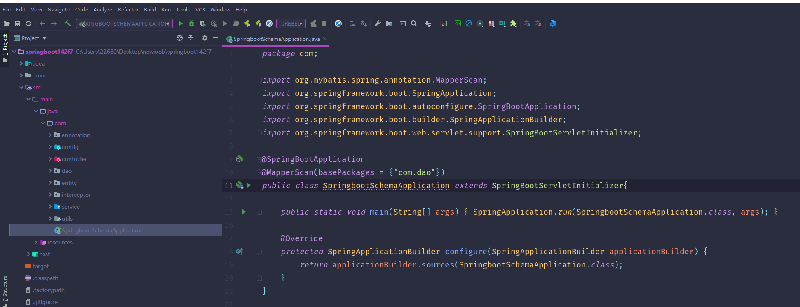

数据库表

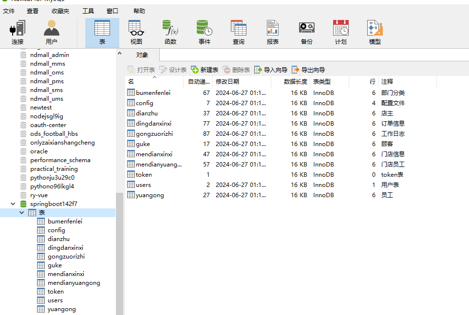

登录

顾客端个人信息

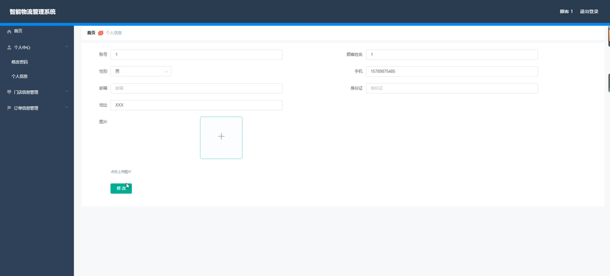

门店信息管理

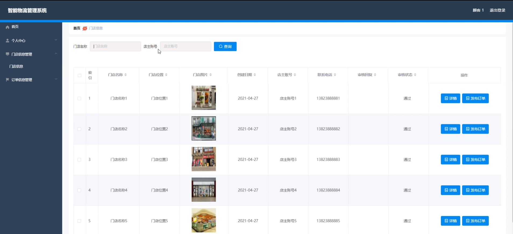

订单信息管理

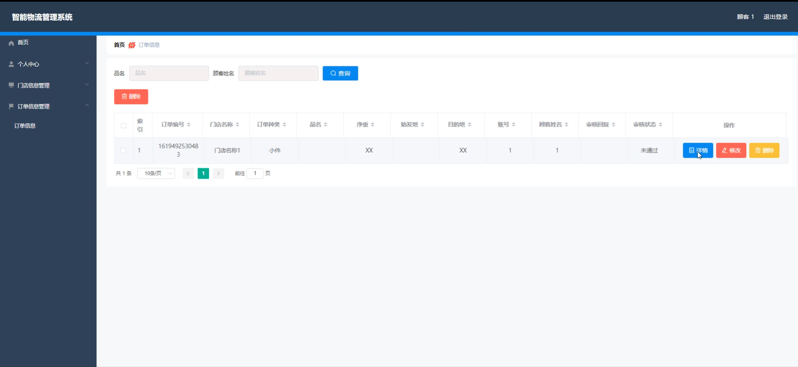

顾客管理

店主管理

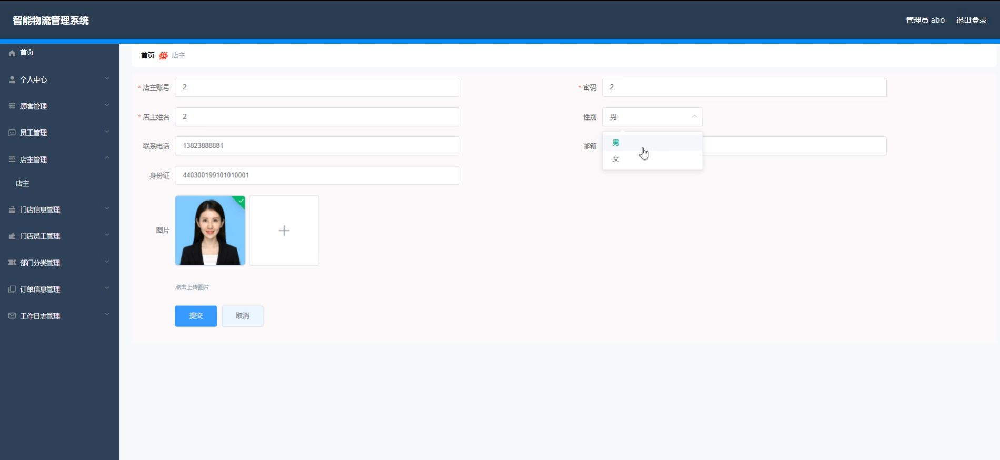

工作日志管理

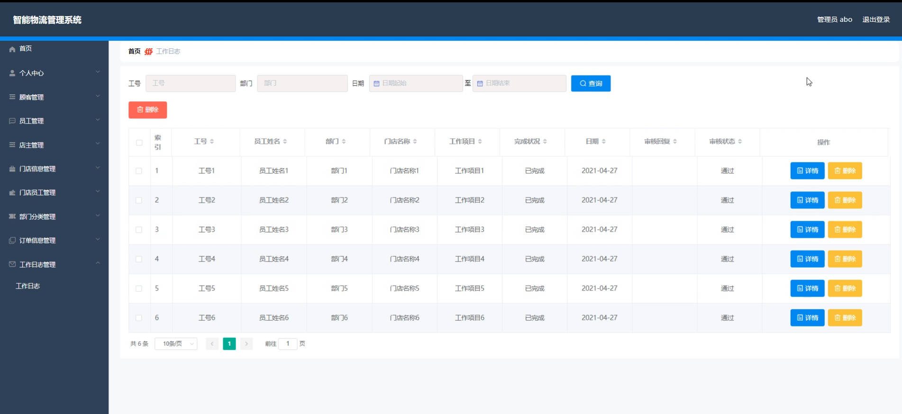

店主端门店信息

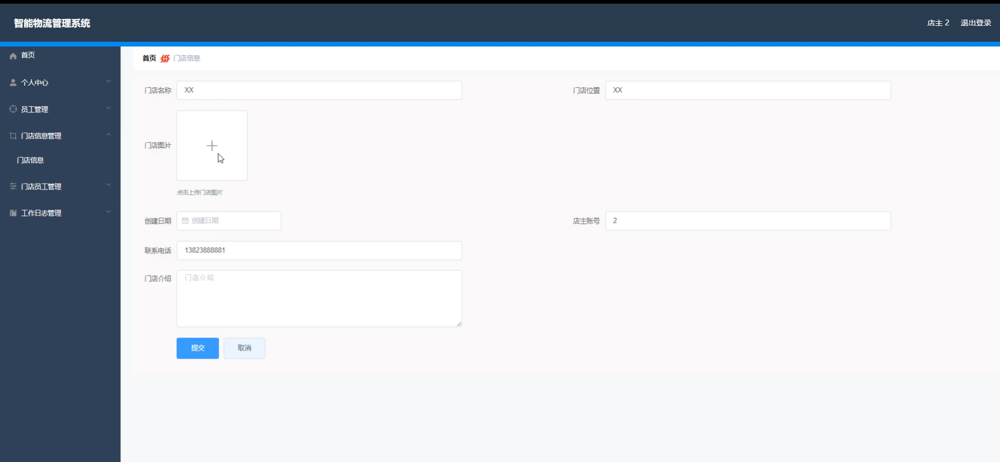

员工端个人信息

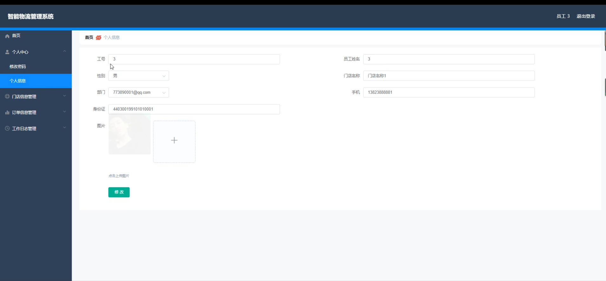

管理员端部门分类管理

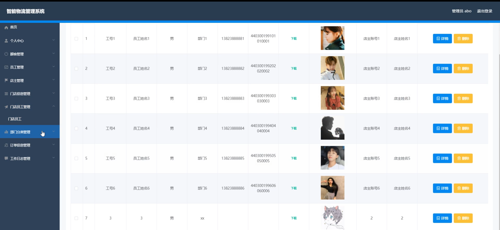

门店员工管理

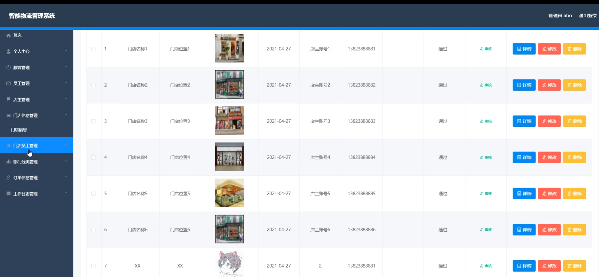

#### 总结

本基于 Spring Boot + Vue 的智能物流管理系统，通过清晰的角色划分和全面的功能模块，实现了物流管理的智能化、精细化和协同化。无论是管理员的统筹规划，店主的门店运营，员工的具体执行，还是顾客的服务体验，都在系统中得到了有效的支持和保障。该系统不仅提升了物流企业的内部管理效率和服务质量，还为企业的持续发展和市场竞争提供了强大的动力。未来，随着技术的进步和业务的拓展，系统将不断升级完善，为物流行业的创新发展贡献更大的价值。

#### 使用说明

创建数据库，执行数据库脚本 修改jdbc数据库连接参数 下载安装maven依赖jar 启动idea中的springboot项目

后台地址：http://localhost:8080/springboot142f7/admin/dist/index.html

管理员  abo 密码 abo
